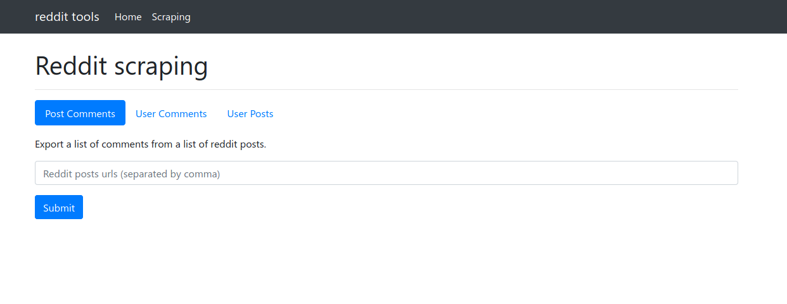

# django-reddit

<a href="pictures/image.png"></a>

Simple django site acting as a frontend for:

- [reddit-scraper](https://github.com/dbeley/reddit-scraper): Various scripts for donwloading posts/submissions/comments of a reddit subreddit/post/user.
- /r/france Forum Libre redirect.

## Secrets

To run the website, you will need some config files.

### secret.ini
```
[django]
SECRET_KEY=secret_key_here
```

### praw.ini
```
[reddit]
client_id=id_here
client_secret=secret_here
password=password_here
username=username_here
```

### Environment variables

If you can't use ini files (i.e. when deploying with heroku), you can use those environment variables:

- `PRAW_CLIENT_ID`
- `PRAW_CLIENT_SECRET`
- `PRAW_PASSWORD`
- `PRAW_USERNAME`
- `DJANGO_SECRET_KEY`
